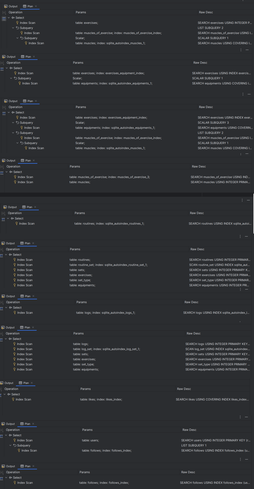

# Design Document

By Mohamed Elsherif

Video overview: <URL HERE>

## Scope

The purpose of the database is to save the necessary data for a gym logger/social application, which users can create
workout routines, records logs, track weights and share these logs.

* Database Scope:
  * Users, including basic identifying information and physical ones.
  * Exercises, including target muscles and equipment used.
  * Routines, including custom rest time between sets.
  * Logs, including weights and repetition for every set.
  * Following functionality.

* Out of Scope:
  * Tracking user weight and muscles metrics with time.
  * Comments on logs.
  * DMs between users.
  * Any non-core functionality.

## Functional Requirements

* User can do all CRUD operations on Routines.
* User can do all CRUD operations on *his* Logs.
* User can follow other users.
* User can like other user's logs.
* User can view all his past sets for a specific exercise.
* User can put access to log.
* User can view other users logs as long as it's accessible.

* User can't keep track of muscles metrics or his physical progress.

## Representation

### Entities

#### USER

* `username` the username of user which he would register/sign in with, it's `UNIQUE` no two users share same username,
  type used is `TEXT`.
* `birthdate` the birthdate of the user to calculate his age, type used is `NUMERIC` because sqlite doesn't support
  separate date types.
* `password` the hashed password of the user, type used is `TEXT` because it's string.
* `height` height of the user in cm which is a whole number thus, `INT` was used.
* `weight` weight of the user in kg which is a decimal number thus, `REAL` was used.

#### ROUTINE (Workout template)

* `user_id` which is the id of user who created this routine it's a `FOREIGN KEY` of type `INT` on `users`.
* `name` the name of the routine e.g `Push workout #A`, it's a string so `TEXT` type was used.
* `access_id` which is a `FOREIGN KEY` on `access` of type `INT` which represents who can see this routine.
* `created_date` which is when this routine was created, and it's of type `NUMERIC`.
* `last_updated` which is when was this routine was last updated, and it's of type `NUMERIC`.
* `name` is `UNIQUE` for every `user_id` which means that routines must have unique names within a user routines.

#### LOG

* `user_id` which is the id of user who created this log it's a `FOREIGN KEY` of type `INT` on `users`.
* `name` the name of the log e.g `Push workout #A`, it's a string so `TEXT` type was used.
* `access_id` which is a `FOREIGN KEY` on `access` of type `INT` which represents who can see this log.
* `created_date` which is when this log was created, and it's of type `NUMERIC`.
* `last_updated` which is when was this log was last updated, and it's of type `NUMERIC`.
* `photo_url` which is the url/path of the photo a user wants to upload with this log it's it can be `NULL` no photo
  uploaded, and it's of type `TEXT`.
* `started_time` which is when this log workout was started, and it's of type `NUMERIC`.
* `last_updated` which is when was log workout was finished, and it's of type `NUMERIC`.
* `name` is `UNIQUE` for every `user_id` which means that logs must have unique names within a user logs.

#### EXERCISE

* `name` name of the exercise and `TEXT` type was used.
* `equipment_id` it's a `FOREIGN KEY` on `equipments` of type `INT` which is the id of the equipment this exercise uses.
* `url` the url of the video tutorial of this exercise, and it's of type `TEXT`.
* `photo_url` the url/path of the photo of this exercise, `TEXT`.
* `description`  the description of how to do this exercise or any additional information about it `TEXT` was used.
* The combination of `name`, `equipment_id` are `UNIQUE` which differentiates the exercise from others.

#### SET

* `exercise_id` a `FOREIGN KEY` on `exercises` which is the id of the exercise played in this set, and it's of type
  `INT`.
* `type_id` a `FOREIGN KEY` on `set_type` which represents the type of this set played type `INT`.
* `repetition` the number of repetition for this set `INT` was used and a `CHECK` that it's a valid positive number.
* `weight` the additional weight used in the set in kg `REAL`, and a `CHECK >= 0` was used.
* `rest` rest time after this set in seconds `INT` and a `CHECK > 0`.

### Sqlite Enums

Since sqlite doesn't support enums separate tables for enums were used.

#### ACCESS

* `status` which is `TEXT` and `UNIQUE` in the set of ('private', 'public', 'following').

#### SET_TYPE

* `type`  which is `TEXT` and `UNIQUE` in the set of ('regular', 'failure', 'drop_set', 'warm_up').

#### MUSCLES

* muscles can be treated also as an enum but because the set of values are large set check was omitted only
  ensured `name` is `UNIQUE`.

### Sqlite Sets

Since sqlite doesn't support by default a set type separate tables for set were used.

#### EQUIPMENTS

* `name` of the equipment which is `TEXT` and `UNIQUE`;

### JOIN Tables

Tables to represent the many-to-many, one-to-many relationships were created.

#### FOLLOWS

* `user1_id` follows `user2_id`.

#### MUSCLES_OF_EXERCISE

* `exercise_id` targets `muscle_id`.

#### LIKES

* `user_id` liked `log_id` at `time`.

#### ROUTINE_SET

* `routine_id` have `set_id` at `order`.

#### LOG_SET

* `log_id` have `set_id` at `order`.

### Data Types chosen

* Used **NUMERIC** date/datetime/timestamp because sqlite doesn't support separate date datatypes.
* Used **REAL** for weight because it can have decimal value.
* Used **TEXT** for names, password, text, description, urls and any strings in general.
* Used **INT** height, repetition, rest (in seconds) because they are all whole numbers.

### Relationships

This diagram represents the relationships between entities, enums, sets and join tables were omitted.

Relationships:

* Following:
  * `USER` can follows **0 or many** other `USER`s.
  * `USER` can be followed by **0 or many** other `USER`s.
* Creating routines:
  * `USER` can create **0 or many** `ROUTINE`.
  * `ROUTINE` must be created by **one and only one** `USER`.
* Recording logs:
  * `USER` can create **0 or many** `LOG`.
  * `LOG` must be created by **one and only one** `USER`.
* Likes logs:
  * `USER` can like **0 or many** `LOG`s.
  * `LOG` can be liked by **0 or many** `USER`.
* Log has sets:
  * `LOG` can have **0 or many** `SET`s.
  * `SET` can be in **0 or many** `LOG`s.
* Routine has sets:
  * `ROUTINE` can have **0 or many** `SET`s.
  * `SET` can be in **0 or many** `ROUTINE`s.
* EXERCISE in sets:
  * `EXERCISE` can be in **0 or many** `SET`s.
  * `SET` has **one and only one** `EXERCISE`.

## Optimizations

In this section you should answer the following questions:

* Usage of `ROWID` as primary key for all tables made sqlite create auto indexes.

### Indexes

* Searching exercises by muscles_id is queried a lot so created an index `muscles_of_exercise (muscle_id)`.
* Searching exercises by equipment_id is queried a lot so created an index `exercises (equipment_id)`.
* Searching muscles by exercise_id is queried a lot so created an index `muscles_of_exercise (exercise_id)`.
* Searching follows by following is queried a lot so created an index `follows (user2_id)`
* Searching likes of a log is queried a lot so created an index `likes (log_id)`.

All queries in `queries.sql` are optimized and uses indexes for search no full scans.

## Limitations

* The current schema doesn't support creating custom exercises.
* The representation of exercises in routines or logs are not organized as both routines and logs consists directly
  of sets not exercises that have sets (groups of sets).
